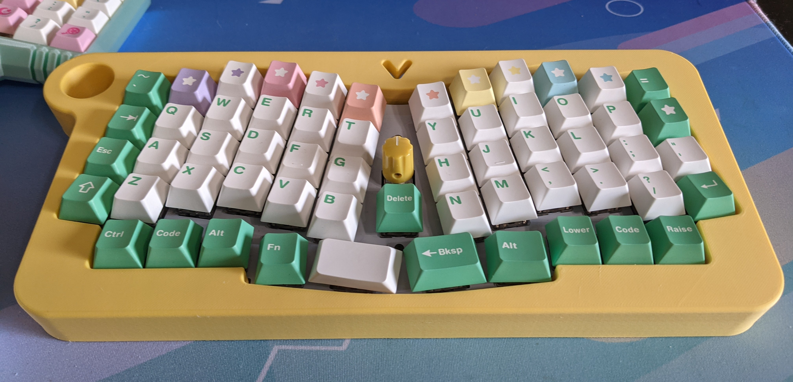

# Vanana (rev2) Build Guide

Written: February 2021

Last Updated: February 2021

*Note: Images in this guide were taken using test-build components before the group buy. It is possible there are minor differences between the components you see in these photos and the group buy products you received.*

# Materials Needed

## Came with kit

* 1 Vanana PCB
* 1 plate
* 1 bottom/case
* 28 spacers (14 short, 14 tall)
* 14 bolts
* 14 nuts
* 42 washers
* 0-2 rotary encoders and knobs (2 encoders only supported if using Elite-C controller)

## Bought separately

I bought the pins from [Digikey](https://www.digikey.com/en/products/detail/3320-0-00-15-00-00-03-0/ED1134-ND/4147392) and the sockets and controller from [Little Keyboards](https://www.littlekeyboards.com/collections/miscellaneous/products/mill-max-ultra-low-profile-sockets). The other pieces are standard and easy to find.

* 1 ProMicro or Elite-C controller
* microUSB/USB-C cable (depending on controller choice)
* 58-60 switches, keycaps
* 2 12-pin Mill-Max ultra low profile sockets
* 24 Mill-Max pins (or can use pins cut from leftover through-hole diode wires or through-hole 3mm LED wires)

## Tools

* tweezers
* 1.5 mm allen wrench
* soldering iron
* solder

# Step 1: Install the sockets

Note that the PCB holes for the controller are labelled on the bottom of the PCB, so it is easy to see which orientation for the ProMicro controller is correct.


Place the sockets where the ProMicro must be inserted on the bottom of the PCB.


Tape the sockets in place with masking/washi tape on the bottom of the PCB. Then turn the PCB over and solder the sockets in place on the top side of the PCB.


# Step 2: Install rotary encoder(s) [optional]

If you will be using a rotary encoder (or 2 rotary encoders, if using Elite-C), now is the time to place them and solder them.  On the back of the PCB there are four boxes labeled RT1, RT2, RT3, RT4.  These are the supported spaces for rotary encoders.  Place the encoders carefully from the top side of the PCB, ensuring that the 5 pins and the two stabilizers on the side do not get bent or damaged.  Then turn the PCB over and solder the 5 pins on the bottom of the PCB.  (See image at end of step 3)

# Step 3: Install switches

Note that your PCB has several bottom row configurations.  Choose your desired layout and insert switches appropriately.

*Example: 3x1u, 2x1.25u, 2x1.25u, 3x1u layout*


*Example: 3x1u, 1.25u, 1.5u, 1.5u, 1.25u, 3x1u layout*


Place the short spacers over the 14 bolt holes in the top of the PCB, with washers underneath to protect the PCB. 

Now place the plate over the PCB, ensuring 
* the 14 bolt holes line up
* each switch's pins go through the corresponding PCB holes undamanged, and 
* any rotary encoders fit through their spots on the plate.

Insert the bolts to hold the spacers in place.

*View from top of PCB/plate (bolts not placed yet in this image)*


*View from bottom of PCB/plate (bolts not placed yet in this image)*


# Step 4: Install the controller

I will say "ProMicro" throughout this section, but you could use an Elite-C controller and follow the exact same process.

First, I recommend [flashing your firmware](#firmware) to the ProMicro to verify that it works.  You don't want to solder and install a faulty controller and only find out when the build is completely finished!

After verifying that the ProMicro works, you can install it by following these steps:
* There should still be tape over the top of the sockets holding them in place from step 1.  If not, place new tape, so you don't accidentally flow solder from the ProMicro to the sockets.
* Place the ProMicro over the sockets in the correct alignment we observed in step 1.
* Insert the pins (standalone Mill-Max pins or leftover through-hole diode wires or leftover 3mm LED wires) into each hole on the ProMicro.
* Press each pin firmly into the socket.
* Solder each pin to the ProMicro.  If you used leftover wires from other components, you will want to cut the excess wire off (close to the solder joint).
* Pull the ProMicro out of the sockets, remove the tape. Press the ProMicro back into the sockets.


# Step 5: Install the spacers and align bottom/case

Turn your build so that the bottom side of the PCB is facing up.  You should see the 14 bolts protruding from the holes.  Place a washer on each bolt (to protect the PCB), then screw one long spacer onto each bolt.  Place another washer on top of each spacer (to protect the case).


Place the case over the bolts and PCB.  Align it so that the bolts poke through the holes in the bottom of the case.  There is an extra hole in the bottom of the case to provide access to the PCB reset button.  And there is a hole in the top side of the case to provide access to the USB port.

Use the nuts provided to secure the bolts to the bottom of the case.

# Step 6: Complete the build

You're almost there! Place your keycaps and plug in your new keyboard!



Plug a USB micro cable into port on the PCB, accessible via the hole in the case, and the other end of the cable into your device.

If you already flashed your firmware as suggested in step 4 above, you are ready to go!  If you haven't flashed your firmware yet, or you skipped down here to figure out how to flash firmware as part of step 4, read on.

# Firmware flashing and customization <a name="firmware"></a>

ProMicro and Elite-C controllers are both QMK compatible, and the default keymap for the Vanana is included in the QMK repository.  If you've never used QMK before, you should [start here](https://docs.qmk.fm/#/newbs).

Once you have your QMK environment set up, you are ready to build the firmware.  I use the command line for all my QMK work because I work on Linux and I am comfortable using the command line.  If you are not comfortable with that, I recommend you follow the link above and look for the "GUI" link.

## To build and flash the default Vanana firmware:

In the `qmk_firmware` directory run the following command:

```
make nckiibs/vanana/rev2:default:avrdude
```

When prompted to reset your controller:
* If you haven't installed the ProMicro yet, use your tweezers to short the RST and GRD pins to put the controller in bootloader mode.  Note that you may have to short them twice in quick succession.
* If you've already installed the ProMicro onto the PCB, just press the reset switch on the PCB.

## To build and flash custom Vanana firmware:

Create a new directory for your custom keymap. I will call it `custom_example` in this document.

In the `qmk_firmware/keyboards/nckiibs/vanana/keymaps` directory, create the new keymap directory and copy the default keymap files as a starting point.

```
mkdir custom_example
cp default/* custom_example/
```

Now edit `custom_example/keymap.c` as you like using the [QMK keycodes](https://docs.qmk.fm/#/keycodes).  When you're ready, compile and flash:

```
make nckiibs/vanana/rev2:custom_example:avrdude
```

When prompted to reset your controller:
* If you haven't installed the ProMicro yet, use your tweezers to short the RST and GRD pins to put the controller in bootloader mode.  Note that you may have to short them twice in quick succession.
* If you've already installed the ProMicro onto the PCB, just press the reset switch on the PCB.